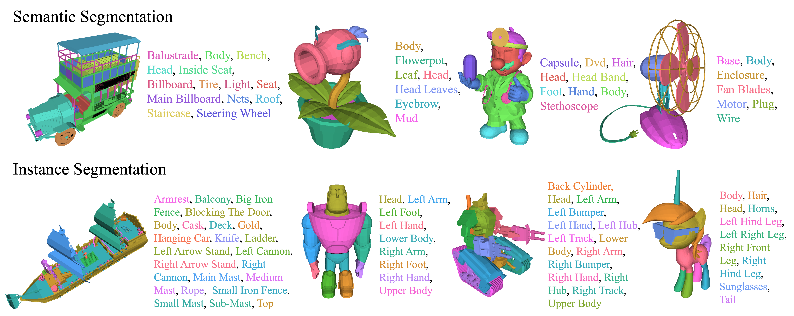

## PartObjaverse-Tiny

[PartObjaverse-Tiny](https://huggingface.co/datasets/yhyang-myron/PartObjaverse-Tiny) is a 3D part segmentation dataset which provides detailed semantic-level and instance-level part annotations for 200 complex 3D objects from [Objaverse](https://objaverse.allenai.org/). Following [GObjaverse](https://aigc3d.github.io/gobjaverse/), we divide these 200 objects into 8 categories: Human-Shape (29), Animals (23), Daily-Used (25), Buildings&&Outdoor (25), Transportations (38), Plants (18), Food (8) and Electronics (34). 

PartObjaverse-Tiny can be downloaded [here](https://huggingface.co/datasets/yhyang-myron/PartObjaverse-Tiny).



### File Description
- **PartObjaverse-Tiny_mesh**: 200 Meshes in glb format, named with uids.
- **PartObjaverse-Tiny_semantic.json**: Label set for each mesh.
- **PartObjaverse-Tiny_semantic_gt**: The ground truth of the semantic segmentation task. Each GT number corresponds in order to each label in the label set.
- **PartObjaverse-Tiny_instance_gt**: The ground truth of the instance segmentation task. Each GT number corresponds to an instance and does not represent semantics.

### Usage
```
pip install trimesh
```
```bash
mesh = trimesh.load(${MESH_PATH})
if isinstance(mesh, trimesh.Scene):
    mesh = mesh.dump(concatenate=True)
mesh_faces = mesh.faces()
```
The face order in GT is consistent with the order of ``mesh_faces``.

Evaluation codes are in ``SAMPart3D/PartObjaverse-Tiny/eval/``.