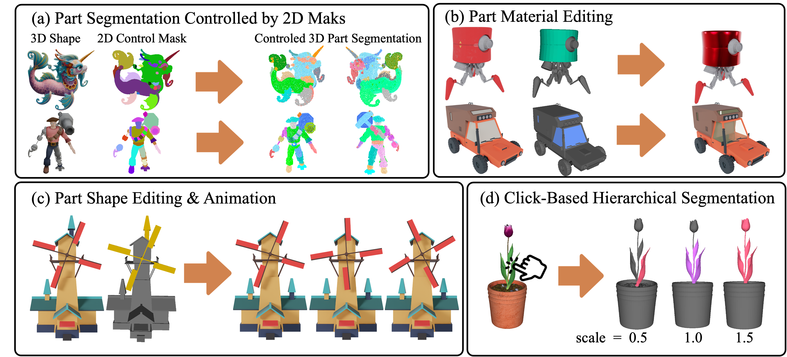

# SAMPart3D
## [Project Page](https://yhyang-myron.github.io/SAMPart3D-website/) | [Paper]()

**Codes will be coming soon.**


SAMPart3D is able to segment any 3D object into semantic parts across multiple levels of granularity, without the need for predefined part label sets or text prompts. It supports a range of applications, including part-level editing and interactive segmentation.

### Visualization of multi-granularity 3D part segmentation.


### Visualization of 3D part editing.



## Citation
If you find _SAMPart3D_ useful in your project, please cite our work. :)
```
@article{yang2024sampart3d,
      title={SAMPart3D: Segment Any Part in 3D Objects}, 
      author={Yunhan Yang and Yukun Huang and Yuan-Chen Guo and Liangjun Lu and Xiaoyang Wu and Edmund Y. Lam and Yan-Pei Cao and Xihui Liu},
      journal={arXiv preprint arXiv:2411.07184},
      year={2024},
}
```
